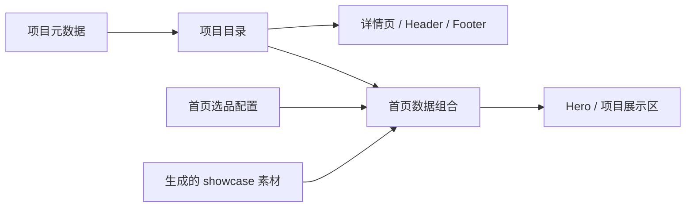

# 首页代码边界

此次拆分用于减少布局、项目维护和截图更新触碰同一文件的机会。它不能自动解决产品方向不同造成的语义冲突；并行任务仍应保持范围明确，并在合并前与最新 main 校验。

## 文件职责

| 变更类型                       | 修改入口                                            | 边界                                                                        |
| ------------------------------ | --------------------------------------------------- | --------------------------------------------------------------------------- |
| 首页章节顺序                   | `apps/web/src/components/HomePage.astro`            | 只组合章节和读取首页数据                                                    |
| 单个章节布局                   | `apps/web/src/components/home/Home*.astro`          | Hero、About、Projects、Commercial、Vision、Releases、Collaboration 独立维护 |
| 项目展示行                     | `apps/web/src/components/home/HomeProjectRow.astro` | 使用传入的项目与展示配置，不按项目 ID 判断样式                              |
| 首页 CSS                       | `apps/web/src/styles/home.css`                      | 包含首页布局、断点和运动效果，仅首页引入                                    |
| 全站样式                       | `apps/web/src/styles/global.css`                    | 主题 token、基础排版、通用 reveal 和无障碍偏好                              |
| 首页文案                       | `apps/web/src/i18n/home/zh-CN.ts`、`en.ts`          | `i18n/ui.ts` 组合并保留既有 `siteCopy` 接口                                 |
| 项目状态、链接和详情内容       | `apps/web/src/content/projects/<id>.json`           | 手工维护，不受截图生成器改写                                                |
| 首页选品、排序、布局和阶段标签 | `apps/web/src/content/home-projects.ts`             | 显式配置；不跟随整个项目目录自动增加                                        |
| 首页生成素材                   | `apps/web/src/content/showcases/<id>.json`          | 仅包含 `images`，由素材生成命令维护                                         |
| 内容校验和类型                 | `apps/web/src/content/schemas.ts`                   | Astro collection 与 TypeScript 类型共享 schema                              |

## 数据流



`lib/home.ts` 负责加载素材 collection，纯函数 `lib/home-projects.ts` 按 ID 关联三种数据。新增项目可先进入目录和详情页，不必同时准备首页截图。需要出现在首页时，再添加素材和选品配置。缺少项目、缺少图片、孤立素材引用或重复选品会报错，避免静默漏图或读取 `undefined`。

Hero 和项目区共享组装后的 `showcase`，详情页只使用项目 JSON 中的 `primary`、`secondary`。更新项目状态会自然传入首页，不需要修改组件。展示模式与图片 `sizes` 的回退规则放在 `components/home/media-sizes.ts`；调整媒体布局时同时检查该文件，懒加载图片优先使用实际渲染尺寸。

共享主题声明使用 `@theme inline static`，确保独立页面 CSS 引用的字体等变量始终存在。否则 Tailwind 只分析全局入口时可能裁掉这些变量，使外部 CSS 的 `font` 简写失效。E2E 检查首页标签的实际字号和字体，覆盖这一问题。

## 并行修改约定

- 截图任务只更新源截图、采集记录、生成素材和对应 caption，不改项目状态或页面布局。
- 产品资料任务只更新对应项目文件；增加首页入口属于单独的选品决定。
- 首页布局任务修改具体章节及 `home.css`，只有全站主题或基础排版变化才修改 `global.css`。
- 不使用 Git 的 `ours`/`theirs` 合并策略或自动保留一侧的属性来掩盖内容冲突。先确认哪些产品变化需要保留，再逐项合并。
- 多个任务避免长时间同时重写同一章节；将纯移动重构与功能变更分开提交，便于审查。

## 验证

`lib/home-projects.test.ts` 覆盖目录扩展、排序独立性、项目资料与素材分别更新、失效引用和 schema 校验。原 E2E 继续检查页面、analytics、链接、SEO 和图片表现。

本次实际运行素材生成器前后，三个项目 JSON 的 SHA-256 完全一致。生成 WebP/AVIF 的内容也保持不变。schema 会拒绝在项目 visuals 中重新加入 showcase，以及在生成素材中混入项目状态。

完整检查通过：19 项单测、50 项 E2E（2 项线上统计测试默认跳过）、14 个构建页面、19 项必需产物及 28 组视觉检查。重构前后 56 张截图尺寸一致；初次对比有 51 张逐像素一致，其余差异均位于图片内部，图片外的布局和文字逐像素一致。截图脚本已补充响应式候选切换后的等待，避免更改 `loading` 属性后立即截图造成时序差异。

```bash
rtk pnpm check
rtk pnpm --filter @weapp.dev/web build
rtk pnpm --filter @weapp.dev/web test:e2e
rtk pnpm --filter @weapp.dev/web media:verify-showcase
```

截图复核使用现有本地预览 `http://127.0.0.1:4321/`。重构前截图保留在 `apps/web/.cache/structure-before/`，重构后使用 `apps/web/.cache/showcase-qa/`。
